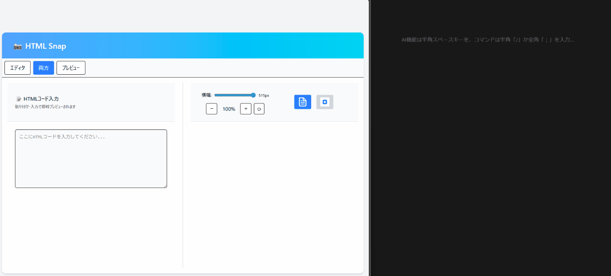

# HTML Snap

## AI 生成 HTML コードを即画像化・コピーできるツール

Claude などの AI で生成した HTML コードを貼り付けるだけで、即座にレンダリング結果を表示し、ワンクリックで画像としてコピーできるツールです。

画像はそのまま Notion などのメモアプリやドキュメントに、手間なく貼り付けることができます。

---

## 技術スタック

| カテゴリ       | 技術・サービス                              |
| -------------- | ------------------------------------------- |
| フロントエンド | Next.js / React / TypeScript / Tailwind CSS |
| バックエンド   | Next.js API Routes                          |
| 画像生成       | Puppeteer                                   |
| テスト         | Jest / Playwright                           |
| CI             | GitHub Actions                              |
| 開発支援       | GitHub Copilot / ESLint / Prettier / Docker |

---

## 主な機能

### HTML コードの即時レンダリング

- AI で生成した HTML コードを入力欄に貼り付けるだけで、リアルタイムでレンダリング結果を表示

### ワンクリック画像コピー

- 表示されたレンダリング結果をワンクリックで画像としてクリップボードにコピー
- Notion などのメモアプリに直接貼り付け可能

### 部分画像切り出し

- プレビュー画面上の任意の要素をハイライトし、クリックした領域のみ画像としてクリップボードにコピー
